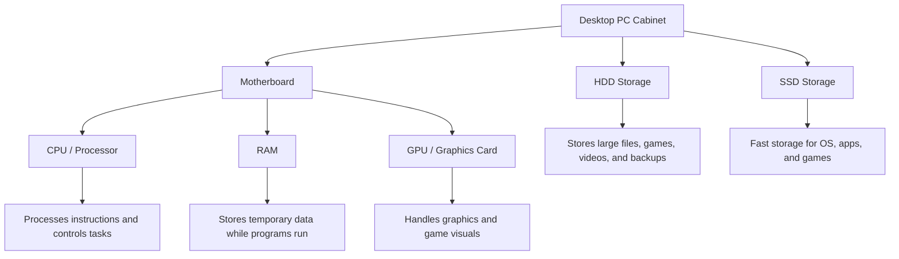

# Desktop PC Hardware Assignment

## 1. Labeled Diagram of a Desktop PC

The motherboard is the main circuit board of the desktop PC. The CPU, RAM, GPU, HDD, and SSD are connected directly or indirectly to the motherboard.

This is a labeled block diagram of a desktop PC showing the main internal hardware components.
---

## 2. Difference Between HDD and SSD

| Feature           | HDD                                                         | SSD                                                        |
| ----------------- | ----------------------------------------------------------- | ---------------------------------------------------------- |
| Full Form         | Hard Disk Drive                                             | Solid State Drive                                          |
| Speed             | Slower because it uses moving mechanical parts              | Faster because it uses flash memory                        |
| Durability        | Less durable because it can be damaged by shock or movement | More durable because it has no moving parts                |
| Noise             | Can make noise due to spinning disk                         | Silent operation                                           |
| Cost              | Cheaper for large storage                                   | More expensive than HDD                                    |
| Typical Use Cases | Storing movies, documents, backups, and large files         | Installing operating system, games, and important software |
| Best For          | Large storage at low cost                                   | High speed and better performance                          |

---

## 3. Role of CPU, RAM, and GPU in Running Games Like PUBG or Free Fire

### CPU

The CPU is the brain of the computer. In games like PUBG or Free Fire, it handles game logic, player movement, enemy actions, controls, and background calculations.

### RAM

RAM stores temporary data while the game is running. More RAM helps the game load faster, reduces lag, and allows smooth multitasking while playing.

### GPU

The GPU handles graphics and visuals in the game. It is responsible for rendering characters, maps, shadows, textures, and smooth frame rates.

---

## 4. Hardware Upgrades for Running the Latest Version of FIFA Smoothly

To run the latest version of FIFA smoothly, I would consider upgrading the following components:

### 1. GPU / Graphics Card

The GPU is very important for gaming performance. Upgrading the GPU helps improve graphics quality, frame rate, and smooth gameplay.

### 2. RAM

Upgrading RAM helps the game run smoothly without lag. For modern games, at least 8 GB RAM is needed, but 16 GB RAM is better for smooth performance.

### 3. SSD

Installing FIFA on an SSD reduces loading time and improves overall system speed. An SSD is much faster than an HDD.

### 4. CPU / Processor

A better CPU helps in faster processing of game logic, physics, and background tasks. If the CPU is old, the game may lag even with a good GPU.

### 5. Power Supply Unit

If a powerful GPU is added, a better power supply may be required. A good PSU gives stable power to all components and protects the PC.

### 6. Cooling System

Gaming creates heat inside the PC. Better cooling helps maintain performance and prevents overheating during long gaming sessions.

---

## Conclusion

A desktop PC contains important components like the motherboard, CPU, RAM, GPU, HDD, and SSD. For gaming performance, CPU, RAM, GPU, and SSD are very important. To play modern games like FIFA smoothly, upgrading GPU, RAM, SSD, and CPU can improve speed, graphics, and overall gameplay experience.
