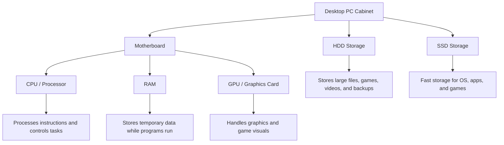
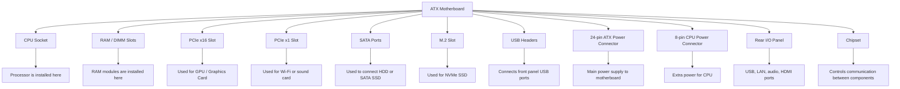

# Desktop PC Hardware Assignment
DAY - 1
## 1. Labeled Diagram of a Desktop PC

The motherboard is the main circuit board of the desktop PC. The CPU, RAM, GPU, HDD, and SSD are connected directly or indirectly to the motherboard.

This is a labeled block diagram of a desktop PC showing the main internal hardware components.
---

## 2. Difference Between HDD and SSD

| Feature           | HDD                                                         | SSD                                                        |
| ----------------- | ----------------------------------------------------------- | ---------------------------------------------------------- |
| Full Form         | Hard Disk Drive                                             | Solid State Drive                                          |
| Speed             | Slower because it uses moving mechanical parts              | Faster because it uses flash memory                        |
| Durability        | Less durable because it can be damaged by shock or movement | More durable because it has no moving parts                |
| Noise             | Can make noise due to spinning disk                         | Silent operation                                           |
| Cost              | Cheaper for large storage                                   | More expensive than HDD                                    |
| Typical Use Cases | Storing movies, documents, backups, and large files         | Installing operating system, games, and important software |
| Best For          | Large storage at low cost                                   | High speed and better performance                          |

---

## 3. Role of CPU, RAM, and GPU in Running Games Like PUBG or Free Fire

### CPU

The CPU is the brain of the computer. In games like PUBG or Free Fire, it handles game logic, player movement, enemy actions, controls, and background calculations.

### RAM

RAM stores temporary data while the game is running. More RAM helps the game load faster, reduces lag, and allows smooth multitasking while playing.

### GPU

The GPU handles graphics and visuals in the game. It is responsible for rendering characters, maps, shadows, textures, and smooth frame rates.

---

## 4. Hardware Upgrades for Running the Latest Version of FIFA Smoothly

To run the latest version of FIFA smoothly, I would consider upgrading the following components:

### 1. GPU / Graphics Card

The GPU is very important for gaming performance. Upgrading the GPU helps improve graphics quality, frame rate, and smooth gameplay.

### 2. RAM

Upgrading RAM helps the game run smoothly without lag. For modern games, at least 8 GB RAM is needed, but 16 GB RAM is better for smooth performance.

### 3. SSD

Installing FIFA on an SSD reduces loading time and improves overall system speed. An SSD is much faster than an HDD.

### 4. CPU / Processor

A better CPU helps in faster processing of game logic, physics, and background tasks. If the CPU is old, the game may lag even with a good GPU.

### 5. Power Supply Unit

If a powerful GPU is added, a better power supply may be required. A good PSU gives stable power to all components and protects the PC.

### 6. Cooling System

Gaming creates heat inside the PC. Better cooling helps maintain performance and prevents overheating during long gaming sessions.

---

## Conclusion

A desktop PC contains important components like the motherboard, CPU, RAM, GPU, HDD, and SSD. For gaming performance, CPU, RAM, GPU, and SSD are very important. To play modern games like FIFA smoothly, upgrading GPU, RAM, SSD, and CPU can improve speed, graphics, and overall gameplay experience.

DAY - 2
## 1. Labeled Diagram of an ATX Motherboard

### Labeled Parts Marked in the Diagram

1. CPU Socket  
2. RAM / DIMM Slots  
3. PCIe x16 Slot  
4. PCIe x1 Slot  
5. SATA Ports  
6. M.2 Slot  
7. USB Headers  
8. 24-pin ATX Power Connector  
9. 8-pin CPU Power Connector  
10. Rear I/O Panel  
11. Chipset  

---

## 2. Popular CPU Socket Types and Compatible CPU Models

| CPU Socket Type | Compatible CPU Model | Description |
|---|---|---|
| LGA1151 | Intel Core i5-9400F | Used with many Intel 8th and 9th generation desktop processors |
| AM4 | AMD Ryzen 5 5600 | Used with many AMD Ryzen desktop processors |
| LGA1200 | Intel Core i5-10400 | Used with many Intel 10th and 11th generation desktop processors |

---

## 3. Functions of CPU and Chipset

### CPU

The CPU is the main processing unit of the computer. It performs calculations, runs instructions, and controls the main tasks of the system. When we open an application like Spotify, the CPU processes the command and starts the application.

### Chipset

The chipset is an important part of the motherboard that helps different components communicate with each other. It manages data flow between the CPU, RAM, storage devices, USB ports, and other hardware. It works like a traffic controller on the motherboard.

### How CPU and Chipset Work Together When Opening Spotify

When we open Spotify, the CPU starts processing the application instructions. The chipset helps the CPU access data from the SSD or HDD and sends the required data to RAM. It also manages communication with audio hardware, USB devices, internet/LAN, and other motherboard components so that Spotify can open and play music smoothly.

---

## 4. Real Motherboard Photo With Labeled Ports and Slots

I used a real motherboard photo and identified different ports and slots by circling and labeling them.

### Identified Motherboard Parts

| Label | Motherboard Part | Use |
|---|---|---|
| 1 | CPU Socket | Used to install the processor |
| 2 | RAM / DIMM Slots | Used to install RAM modules |
| 3 | 24-pin ATX Power Connector | Provides main power to the motherboard |
| 4 | PCIe x16 Slot | Used to install a graphics card |
| 5 | M.2 / NVMe SSD Slot | Used to install a fast NVMe SSD |
| 6 | SATA Ports | Used to connect HDD or SATA SSD |
| 7 | Rear I/O Ports | Used for USB, LAN, audio, and display ports |
| 8 | Chipset Heatsink | Helps cool and protect the chipset |
| 9 | CMOS Battery | Stores BIOS settings and system time |
| 10 | 8-pin CPU Power Connector | Provides extra power to the CPU |

### Labeled Motherboard Image

---

## Conclusion

An ATX motherboard connects important computer components such as CPU, RAM, GPU, storage devices, and power supply. The CPU performs processing tasks, while the chipset manages communication between different hardware parts. Understanding motherboard slots and ports is important for assembling, upgrading, and troubleshooting a computer.
