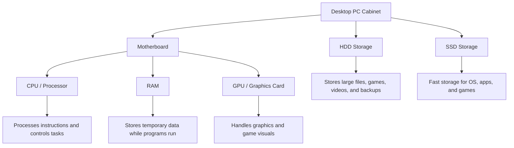
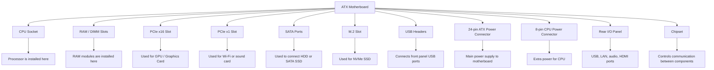
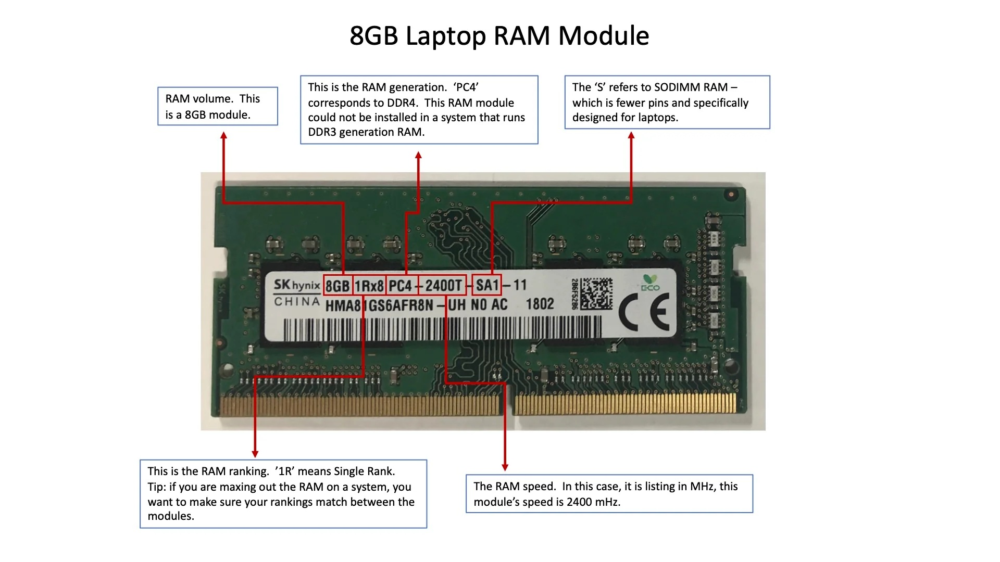
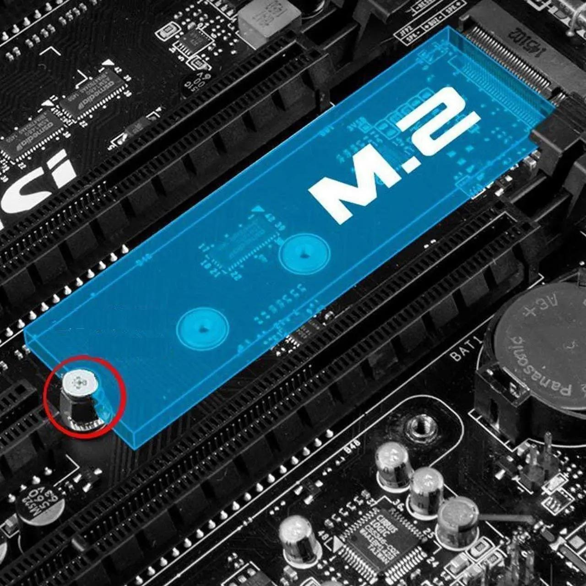

# Desktop PC Hardware Assignment

# DAY - 1: Overview of Hardware Components

## 1. Labeled Diagram of a Desktop PC

The motherboard is the main circuit board of the desktop PC. The CPU, RAM, GPU, HDD, and SSD are connected directly or indirectly to the motherboard.

This is a labeled block diagram of a desktop PC showing the main internal hardware components.
---

## 2. Difference Between HDD and SSD

| Feature           | HDD                                                         | SSD                                                        |
| ----------------- | ----------------------------------------------------------- | ---------------------------------------------------------- |
| Full Form         | Hard Disk Drive                                             | Solid State Drive                                          |
| Speed             | Slower because it uses moving mechanical parts              | Faster because it uses flash memory                        |
| Durability        | Less durable because it can be damaged by shock or movement | More durable because it has no moving parts                |
| Noise             | Can make noise due to spinning disk                         | Silent operation                                           |
| Cost              | Cheaper for large storage                                   | More expensive than HDD                                    |
| Typical Use Cases | Storing movies, documents, backups, and large files         | Installing operating system, games, and important software |
| Best For          | Large storage at low cost                                   | High speed and better performance                          |

---

## 3. Role of CPU, RAM, and GPU in Running Games Like PUBG or Free Fire

### CPU

The CPU is the brain of the computer. In games like PUBG or Free Fire, it handles game logic, player movement, enemy actions, controls, and background calculations.

### RAM

RAM stores temporary data while the game is running. More RAM helps the game load faster, reduces lag, and allows smooth multitasking while playing.

### GPU

The GPU handles graphics and visuals in the game. It is responsible for rendering characters, maps, shadows, textures, and smooth frame rates.

---

## 4. Hardware Upgrades for Running the Latest Version of FIFA Smoothly

To run the latest version of FIFA smoothly, I would consider upgrading the following components:

### 1. GPU / Graphics Card

The GPU is very important for gaming performance. Upgrading the GPU helps improve graphics quality, frame rate, and smooth gameplay.

### 2. RAM

Upgrading RAM helps the game run smoothly without lag. For modern games, at least 8 GB RAM is needed, but 16 GB RAM is better for smooth performance.

### 3. SSD

Installing FIFA on an SSD reduces loading time and improves overall system speed. An SSD is much faster than an HDD.

### 4. CPU / Processor

A better CPU helps in faster processing of game logic, physics, and background tasks. If the CPU is old, the game may lag even with a good GPU.

### 5. Power Supply Unit

If a powerful GPU is added, a better power supply may be required. A good PSU gives stable power to all components and protects the PC.

### 6. Cooling System

Gaming creates heat inside the PC. Better cooling helps maintain performance and prevents overheating during long gaming sessions.

---

# DAY - 2: Motherboard and CPU

## 1. Labeled Diagram of an ATX Motherboard

### Labeled Parts Marked in the Diagram

1. CPU Socket  
2. RAM / DIMM Slots  
3. PCIe x16 Slot  
4. PCIe x1 Slot  
5. SATA Ports  
6. M.2 Slot  
7. USB Headers  
8. 24-pin ATX Power Connector  
9. 8-pin CPU Power Connector  
10. Rear I/O Panel  
11. Chipset  

---

## 2. Popular CPU Socket Types and Compatible CPU Models

| CPU Socket Type | Compatible CPU Model | Description |
|---|---|---|
| LGA1151 | Intel Core i5-9400F | Used with many Intel 8th and 9th generation desktop processors |
| AM4 | AMD Ryzen 5 5600 | Used with many AMD Ryzen desktop processors |
| LGA1200 | Intel Core i5-10400 | Used with many Intel 10th and 11th generation desktop processors |

---

## 3. Functions of CPU and Chipset

### CPU

The CPU is the main processing unit of the computer. It performs calculations, runs instructions, and controls the main tasks of the system. When we open an application like Spotify, the CPU processes the command and starts the application.

### Chipset

The chipset is an important part of the motherboard that helps different components communicate with each other. It manages data flow between the CPU, RAM, storage devices, USB ports, and other hardware. It works like a traffic controller on the motherboard.

### How CPU and Chipset Work Together When Opening Spotify

When we open Spotify, the CPU starts processing the application instructions. The chipset helps the CPU access data from the SSD or HDD and sends the required data to RAM. It also manages communication with audio hardware, USB devices, internet/LAN, and other motherboard components so that Spotify can open and play music smoothly.

---

## 4. Real Motherboard Photo With Labeled Ports and Slots

I used a real motherboard photo and identified different ports and slots by circling and labeling them.

### Identified Motherboard Parts

| Label | Motherboard Part | Use |
|---|---|---|
| 1 | CPU Socket | Used to install the processor |
| 2 | RAM / DIMM Slots | Used to install RAM modules |
| 3 | 24-pin ATX Power Connector | Provides main power to the motherboard |
| 4 | PCIe x16 Slot | Used to install a graphics card |
| 5 | M.2 / NVMe SSD Slot | Used to install a fast NVMe SSD |
| 6 | SATA Ports | Used to connect HDD or SATA SSD |
| 7 | Rear I/O Ports | Used for USB, LAN, audio, and display ports |
| 8 | Chipset Heatsink | Helps cool and protect the chipset |
| 9 | CMOS Battery | Stores BIOS settings and system time |
| 10 | 8-pin CPU Power Connector | Provides extra power to the CPU |

### Labeled Motherboard Image

---

# DAY - 3: RAM and Storage

---

# DAY - 3: RAM and Storage

## 1. Comparison Table: DDR3, DDR4, and DDR5 RAM

| Feature | DDR3 RAM | DDR4 RAM | DDR5 RAM |
|---|---|---|---|
| Full Form | Double Data Rate 3 | Double Data Rate 4 | Double Data Rate 5 |
| Speed | Lower speed compared to DDR4 and DDR5 | Faster than DDR3 | Fastest among DDR3, DDR4, and DDR5 |
| Typical Speed Range | Around 800 MHz to 2133 MHz | Around 2133 MHz to 3200 MHz or higher | Around 4800 MHz and higher |
| Voltage | Around 1.5V | Around 1.2V | Around 1.1V |
| Power Efficiency | Less power efficient | More power efficient than DDR3 | Most power efficient |
| Performance | Suitable for basic computing | Good for modern PCs and gaming | Best for high-performance gaming, editing, and professional work |
| Typical Use Cases | Older desktops and laptops | Modern desktops, laptops, and gaming PCs | Latest high-end desktops, laptops, gaming PCs, and workstations |
| Compatibility | Works only with DDR3-supported motherboard | Works only with DDR4-supported motherboard | Works only with DDR5-supported motherboard |

---

## 2. Practical: RAM Slot Identification and Reinstallation

### Safety Steps Followed

Before opening the laptop or desktop, I followed these safety steps:

1. Shut down the computer completely.
2. Disconnected the power cable or charger.
3. Pressed the power button for a few seconds to discharge remaining power.
4. Opened the back panel or cabinet carefully.
5. Located the RAM slot and RAM module.
6. Removed and reinstalled the RAM module properly.
7. Closed the system and turned it on again.
8. Verified that the system booted successfully.

### RAM Module Reference Image

I performed the RAM practical in front of my instructor.  
At home, I could not reopen my laptop because proper tools were not available, so I used this reference image for documentation.

### Boot Verification

After reinstalling the RAM module, the system booted successfully. This confirms that the RAM was installed properly.

---

## 3. Differences Between HDD, SSD, and NVMe Storage

| Feature | HDD | SSD | NVMe |
|---|---|---|---|
| Full Form | Hard Disk Drive | Solid State Drive | Non-Volatile Memory Express |
| Speed | Slowest because it uses spinning disks | Faster than HDD because it uses flash memory | Fastest because it uses PCIe lanes |
| Connection Type | Usually SATA | Usually SATA | Usually M.2 PCIe |
| Moving Parts | Has moving mechanical parts | No moving parts | No moving parts |
| Durability | Less durable because shock can damage it | More durable than HDD | More durable and faster |
| Cost | Cheapest for large storage | Medium cost | More expensive than SATA SSD |
| Best Use | Large file storage and backups | Operating system, apps, and games | High-speed gaming, editing, and heavy applications |

### Daily App / Use Case Examples

| Storage Type | Best Daily Use Case | Example App |
|---|---|---|
| HDD | Storing large videos, movies, photos, and backups | Google Drive backup files / downloaded movies |
| SSD | Faster booting and smooth app opening | Windows, Chrome, VS Code |
| NVMe | Very fast loading for heavy apps and games | GTA V, FIFA, PUBG PC, video editing software |

---

## 4. Practical: Storage Drive Connector Identification and Reinstallation

### Safety Steps Followed

Before removing the storage drive, I followed these safety steps:

1. Shut down the computer completely.
2. Disconnected the power cable or charger.
3. Opened the laptop back panel or desktop cabinet carefully.
4. Located the storage drive.
5. Identified the connector type such as SATA, M.2, or NVMe.
6. Removed and reinstalled the storage drive carefully.
7. Closed the system and turned it on.
8. Verified that the device recognized the storage after reassembly.

### Storage Connector Reference Image

I performed the storage identification practical in front of my instructor.  
At home, I could not reopen my laptop because proper tools were not available, so I used this reference image to show the storage connector clearly.

### Storage Recognition Confirmation

After reinstalling the storage drive, the device recognized the storage successfully. This confirms that the storage drive was connected properly.

### Practical Note

I performed the RAM and storage identification practical in front of my instructor.  
However, I could not reopen my personal laptop at home because I did not have the proper tools.  
So, for documentation, I used reference images to show the RAM slot and storage connector clearly.

---

---

# DAY - 4: GPUs and Cooling Systems

## 1. GPU Identification

I identified the GPU installed in the system using system information / PC hardware simulator.

| Detail | Information |
|---|---|
| GPU Brand | NVIDIA |
| GPU Model Number | GeForce RTX 3060 |
| GPU Type | Dedicated GPU |
| Memory Type | GDDR6 |
| Common Use | Gaming, video editing, streaming, and graphics-heavy applications |

### Integrated GPU vs Dedicated GPU

An integrated GPU is built into the CPU and shares system RAM. It is useful for normal tasks like browsing, watching videos, and basic applications.

A dedicated GPU is a separate graphics card with its own memory. It gives better performance for gaming, streaming, video editing, and graphics-heavy software.

---

## 2. Cooling System Identification

I identified the cooling system used inside a PC setup. The cooling system helps remove heat from the CPU, GPU, and other components so that the computer can work safely and smoothly.

### Cooling System Screenshot / Photo

### Labeled Cooling Components

| Label | Cooling Component | Function |
|---|---|---|
| 1 | Cooling Fan | Moves hot air away from the component |
| 2 | Heatsink | Absorbs heat from CPU/GPU and spreads it |
| 3 | Heat Pipes | Transfer heat from GPU/CPU to the heatsink |
| 4 | Airflow Path | Helps hot air exit from the cabinet |
| 5 | GPU Cooler | Keeps the graphics card temperature under control |

### Function of Cooling System

When a computer runs games or heavy applications, the CPU and GPU generate heat. The cooling fan and heatsink help reduce this heat. Good cooling improves performance and prevents overheating.

---

## 3. Difference Between Air Cooling and Liquid Cooling for GPUs

| Feature | Air Cooling | Liquid Cooling |
|---|---|---|
| Cooling Method | Uses fans and heatsinks to remove heat | Uses liquid coolant, pump, radiator, and fans |
| Cost | Cheaper and budget-friendly | More expensive than air cooling |
| Efficiency | Good for normal gaming and regular use | Better for high-performance gaming and overclocking |
| Maintenance | Low maintenance and easy to clean | Requires more care and checking |
| Noise | Can be noisy at high fan speed | Usually quieter if properly installed |
| Installation | Easy to install | More complex installation |
| Risk | Very low risk | Small risk of leakage if not installed properly |
| Best Use Case | Normal gaming PC, office PC, budget gaming setup | High-end gaming PC, streaming PC, heavy workload PC |

---

## 4. Best Cooling Choice for Gaming PC

If I am building a gaming PC for streaming IPL matches and playing graphics-heavy games, I would choose **air cooling** for the GPU.

Air cooling is cheaper, easier to install, and requires less maintenance. For normal gaming and streaming, a good air-cooled GPU is enough. Liquid cooling gives better cooling performance, but it is more expensive and needs more care. So, for a balanced gaming PC, air cooling is the better choice.

---

## Practical Note

I used a PC hardware simulator / reference PC setup because opening a real laptop or desktop was not possible at home without proper tools. The GPU and cooling system were identified using a reference setup for learning and documentation.

---
